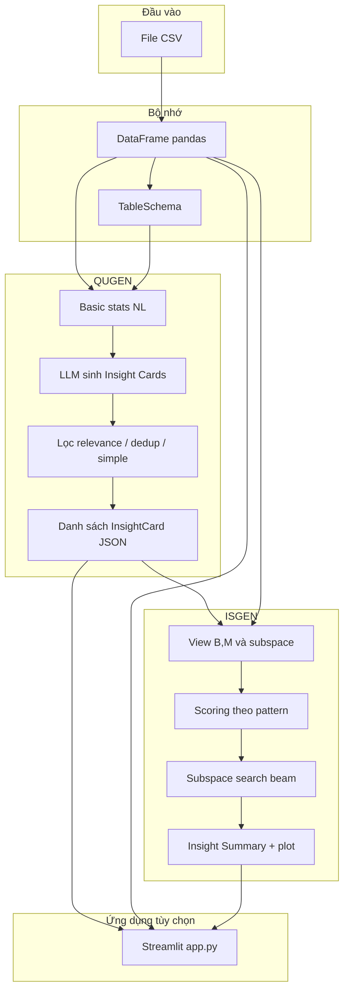

# Methodology — EDAProj (IFQ)

Tài liệu mô tả **phương pháp và cấu trúc kỹ thuật** của project, hiện thực bài báo **IFQ: Question-guided Insights Generation for Automated Exploratory Data Analysis** (arXiv:2410.10270). Mục tiêu là giúp đọc hiểu **luồng dữ liệu**, **vai trò từng module**, và **khác biệt so với bài báo** khi cần.

---

## 1. Mục tiêu hệ thống

Hệ thống nhận **một bảng dữ liệu dạng CSV**, tự động:

1. **Sinh tập câu hỏi phân tích có cấu trúc** (Insight Cards): gồm câu hỏi nghiệp vụ, lý do, chiều **breakdown** (B), **measure** (M).
2. **Khai thác insight trên dữ liệu thật**: tính view (nhóm theo B, aggregate M), gán **pattern** (Trend, Outstanding Value, Attribution, Distribution Difference), có thể tìm **subspace** (lọc theo cột = giá trị).
3. **Xuất báo cáo**: giải thích dạng văn, biểu đồ, khuyến nghị (và giao diện web tùy chọn làm giàu bằng LLM).

Hai khối lõi trong code: **QUGEN** (`ifq/qugen/`) và **ISGEN** (`ifq/isgen/`).

---

## 2. Sơ đồ tổng quan



---

## 3. Cấu trúc thư mục (tinh gọn)

| Đường dẫn | Vai trò |
|-----------|---------|
| `data/` | Dataset CSV mẫu / làm việc |
| `ifq/qugen/` | QUGEN: schema, stats, prompts, LLM client, parser, filters, pipeline |
| `ifq/isgen/` | ISGEN: models, views, scoring, basic insight, subspace search, NL template, plotting, pipeline |
| `run_qugen.py` | CLI chạy QUGEN → `insight_cards.json` |
| `run_isgen.py` | CLI chạy ISGEN → `insights_summary.json` + thư mục plot tùy chọn |
| `app.py` | Giao diện Streamlit: Home / History / Settings; gọi QUGEN+ISGEN và hiển thị |
| `csv_to_schema.py` | Tiện ích: CSV → file JSON schema |
| `docs/` | Tài liệu pipeline chi tiết (`QUGEN_PIPELINE.md`, `ISGEN_PIPELINE.md`, …) |
| `baseline/auto_eda_agent/` | Baseline khác (agent EDA), không phải luồng QUGEN/ISGEN chính |

---

## 4. Khái niệm dữ liệu trung tâm

### 4.1 CSV → DataFrame

- **CSV** là định dạng lưu trữ; khi chạy pipeline, file được đọc bằng **pandas** thành **DataFrame** trong RAM.
- DataFrame cho phép `groupby`, lọc dòng, suy luận kiểu cột — toàn bộ ISGEN và phần thống kê cho QUGEN dựa trên đối tượng này.

### 4.2 `TableSchema`

- Định nghĩa trong `ifq/qugen/models.py`: `table_name` + danh sách cột `{name, dtype, description?}`.
- **`schema_from_dataframe`**: suy `INT` / `DOUBLE` / `CHAR` từ kiểu pandas.
- Dùng để: prompt LLM QUGEN, text cho embedding lọc relevance.

### 4.3 Insight Card (đầu ra QUGEN)

- `InsightCard`: `question`, `reason`, `breakdown` (B), `measure` (M).
- `measure` là chuỗi dạng `SUM(Cột)`, `MEAN(Cột)`, `COUNT(*)`, … — ISGEN parse để tính view.

### 4.4 Insight ISGEN

- `Insight(B, M, S, P)` trong `ifq/isgen/models.py`: thêm **Subspace S** (tập bộ lọc cột–giá trị) và **Pattern P**.
- Đầu ra tóm tắt thường là dict JSON: `insight`, `explanation`, `plot_path`, `question`, …

---

## 5. Giai đoạn A — Thống kê cơ bản (Basic stats) phục vụ QUGEN

**Module:** `ifq/qugen/stats.py` — lớp `BasicStatsGenerator`.

**Luồng:**

1. **Sinh câu hỏi thống kê (LLM):** prompt kiểu Figure 7 trong bài báo → LLM trả về các khối `[STAT]...[/STAT]`.
2. **Chuyển thành đoạn “Natural Language Stats”:**
   - Nếu có DataFrame: `_compute_simple_stats` — theo từng cột trong schema, cột số → min/max/mean; cột khác → số giá trị duy nhất (tối đa ~25 dòng).
   - Nếu không có DataFrame hoặc lỗi: liệt kê ~20 câu hỏi stat dạng bullet.

**Vai trò đối với QUGEN:** đoạn văn này được chèn vào prompt QUGEN (`NATURAL LANGUAGE STATS:`) để LLM sinh câu hỏi **bám số liệu và cấu trúc thật**, không chỉ tên cột.

**Lưu ý so với bài báo:** bài mô tả pipeline SQL đầy đủ cho từng câu stat; code hiện tại **không** thực thi text-to-SQL; thống kê là **heuristic theo cột** + câu hỏi stat từ LLM.

---

## 6. Giai đoạn B — QUGEN (Question Generation)

**Module chính:** `ifq/qugen/pipeline.py` — `QUGENPipeline`, `QUGENConfig`.

### 6.1 Cấu hình (`QUGENConfig`)

| Tham số | Mặc định (tham khảo) | Ý nghĩa |
|---------|----------------------|---------|
| `temperature` | 1.1 | Gửi LLM (Chat Completions); với Responses API có thể không gửi |
| `num_samples_per_iteration` | 3 | Số lần gọi LLM độc lập mỗi vòng |
| `num_iterations` | 10 | Số vòng lặp |
| `num_in_context_examples` | 6 | Số card từ pool làm ví dụ trong-context |
| `num_questions_per_prompt` | 10 | Số câu yêu cầu trong một prompt |
| `schema_relevance_threshold` | 0.25 | Ngưỡng cosine similarity câu hỏi ↔ schema |
| `dedup_similarity_threshold` | 0.85 | Ngưỡng coi hai câu hỏi trùng |

### 6.2 Một vòng lặp (`run_one_iteration`)

1. **Ghép prompt** (`ifq/qugen/prompts.py`): mô tả nhiệmụ + few-shot + schema + natural language stats + yêu cầu format `[INSIGHT]...[/INSIGHT]` với `REASON`, `QUESTION`, `BREAKDOWN`, `MEASURE`.
2. **Few-shot động:** từ vòng 2, thêm block `(schema hiện tại, subset card từ pool)` — ưu tiên đa dạng **cột measure** khi chọn card.
3. **Gọi LLM:** `complete_multi` — nhiều mẫu, mỗi mẫu parse riêng.
4. **Parse** (`parser.py`): trích các Insight Card từ text; nếu 0 card có thể ghi `debug_llm_response.txt`.
5. **Lọc (thứ tự):**
   - `filter_by_schema_relevance`: embedding câu hỏi vs text schema — model `all-MiniLM-L6-v2`.
   - `filter_duplicates`: embedding câu hỏi, loại trùng ngưỡng.
   - `filter_simple_questions`: nếu có `run_query_fn` thì giữ khi số “hàng kết quả” > 1; trong app CLI thường dùng placeholder hoặc heuristic (độ dài câu, pattern từ khóa).

### 6.3 Vòng đầy đủ (`run`)

- Tính NL stats **một lần** cho cả pipeline.
- Lặp `num_iterations`: mỗi lần cập nhật **pool** card, dedup pool, chọn in-context cho vòng sau.
- **`_enforce_measure_diversity`:** nếu >50% card dùng chung một cột measure, chạy **thêm một vòng** với `used_measures` để tránh lạm dụng cùng measure.

### 6.4 LLM client

**File:** `ifq/qugen/llm_client.py`.

- **`OpenAICompatibleClient`:** SDK `openai`, có thể dùng **Responses API** (`responses.create`) hoặc **Chat Completions**.
- Biến môi trường: `OPENAI_API_KEY`, `OPENAI_API_BASE` (endpoint tương thích OpenAI), `QUGEN_LLM_MODEL`, `OPENAI_USE_RESPONSES_API`.
- Pipeline CLI vận hành với API thật thông qua `OpenAICompatibleClient`.

### 6.5 Đầu ra QUGEN

- Danh sách `InsightCard` → JSON (CLI: `run_qugen.py --output`).

---

## 7. Giai đoạn C — ISGEN (Insight Generation)

**Module chính:** `ifq/isgen/pipeline.py` — `ISGENPipeline`, `ISGENConfig`.

### 7.1 View

- **View** = nhóm theo cột breakdown B, tính measure M trên DataFrame (có thể sau khi áp subspace S).
- **`views.py`:** `compute_view`, `parse_measure` (SUM/MEAN/COUNT/…), **`resolve_card_columns`** — map tên cột trong card (có thể lệch với CSV) sang tên cột thật.

### 7.2 Pattern và scoring

**File:** `ifq/isgen/scoring.py` — khớp Appendix A trong bài báo.

| Pattern | Hàm điểm (trên vector giá trị theo B) | Ngưỡng gốc |
|---------|----------------------------------------|------------|
| Trend | \(1 - p\) (Mann-Kendall hoặc fallback Spearman) | `T_TREND = 0.90` |
| Outstanding Value | Hai giá trị lớn nhất (theo \|·\|): \(v_1 / v_2\) | `T_OV = 1.4` |
| Attribution | \(\max(v) / \sum v\) | `T_ATTR = 0.5` |
| Distribution Difference | Jensen–Shannon giữa hai phân phối (thường kết hợp subspace) | `T_DD = 0.2` |

**Ngưỡng thực tế:** `get_threshold_scaled(pattern, threshold_scale)` — nhân ngưỡng với `threshold_scale` (UI/CLI dùng để **nới** hoặc **siết** insight).

### 7.3 Basic insight

**File:** `ifq/isgen/basic_insight.py`.

- Với mỗi card đã resolve cột: tính view trên **toàn bộ dữ liệu** (S rỗng).
- Với mỗi pattern phù hợp (Trend chỉ khi breakdown là thời gian / từ khóa temporal trong tên cột), nếu score ≥ ngưỡng → thêm candidate.
- Có thể có **nhiều pattern** đạt ngưỡng trên **cùng một view** (ví dụ cả OV và Attribution) — đó là hai insight khác trường `pattern`, có thể cùng `question`.

### 7.4 Subspace search

**File:** `ifq/isgen/subspace_search.py` — Algorithm 1 (beam).

- Bắt đầu S = ∅, mở rộng thêm bộ lọc (cột X, giá trị y) theo beam width, expansion factor, `max_depth`.
- **LLM tùy chọn** (`llm_filter_columns.py`): gợi ý cột lọc ưu tiên; trộn xác suất với `w_llm`.
- ISGEN subspace search dùng API thật cho bước gợi ý cột.

### 7.5 Gom insight, dedup, giới hạn

- Gom candidate từ basic + subspace; **`_deduplicate_insight_candidates`**: giới hạn số insight overall / subspace theo khóa `(question, B, M, pattern)`.
- **`_limit_per_question`**: tối đa N insight mỗi câu hỏi, ưu tiên đa dạng pattern.

### 7.6 Giải thích và biểu đồ

- **`nl_explanation.py`:** mô tả ngắn **theo template** theo pattern (không gọi LLM trong pipeline CLI).
- **`plotting.py`:** rule-based (line/bar/pie tùy pattern).

### 7.7 Đầu ra ISGEN

- JSON list: `question`, `explanation`, `plot_path`, `insight`, …
- File PNG nếu chỉ định `--plot-dir`.

---

## 8. Giai đoạn D — Ứng dụng Streamlit (`app.py`)

### 8.1 Tab

- **Home:** upload CSV, nút generate → QUGEN → ISGEN → hiển thị insight theo tab pattern (Trend, OV, Attribution, DD).
- **History:** đọc các file `insights_summary*.json` / `insight_cards*` trong project để xem lại (nếu có).
- **Settings:** mock LLM, Rich LLM explanations, slider QUGEN (`max_cards`, `num_iterations`), `threshold_scale` cho ISGEN.

### 8.2 LLM bổ sung (chỉ UI)

- **Rich LLM explanations:** hàm `_generate_llm_description` — viết lại phần Summary từ template + mẫu số liệu; dùng cùng client OpenAI-compatible.
- **Recommendation:** `_build_recommendation` — **luật cố định** theo pattern + top/bottom giá trị, **không** gọi LLM.

---

## 9. Chuỗi lệnh điển hình

```bash
# QUGEN (cần OPENAI_API_KEY)
python run_qugen.py --csv data/transactions.csv --output insight_cards.json

# ISGEN
python run_isgen.py --csv data/transactions.csv --insight-cards insight_cards.json \
  --output insights_summary.json --plot-dir plots

# Web UI
streamlit run app.py
```

---

## 10. Khác biệt chính so với bài báo (tóm tắt)

| Khía cạnh | Bài báo (lý tưởng) | Implementation trong repo |
|-----------|-------------------|-----------------------------|
| NL stats | SQL từ câu stat → chạy DB → dịch NL | Thống kê đơn giản theo cột + câu `[STAT]` từ LLM |
| Simple-question filter | Dựa trên thực thi truy vấn | Chủ yếu heuristic; `run_query_fn` placeholder thường trả cố định |
| LLM thử nghiệm | Llama-3-70B | OpenAI-compatible API (model cấu hình env) |
| Giải thích NL (ISGEN) | Mô tả thuật toán | Template; UI có tùy chọn làm giàu LLM |
| Subspace | Có gợi ý cột LLM | Có; gọi API thật |

Chi tiết: `docs/QUGEN_PIPELINE.md` mục “Khác biệt so với mô tả lý tưởng”.

---

## 11. Phụ thuộc và an toàn

- **Python:** pandas, numpy, scipy (một số scoring), có thể `pymannkendall`, `sentence-transformers` (QUGEN filters), `openai`, `streamlit`, `plotly` (UI chart).
- **API key:** không commit key; dùng biến môi trường hoặc `.env` (nếu có `python-dotenv`).

---

## 12. Tài liệu liên quan trong repo

| File | Nội dung |
|------|----------|
| `README.md` | Hướng dẫn cài đặt và chạy nhanh |
| `docs/QUGEN_PIPELINE.md` | QUGEN theo đúng code |
| `docs/QUGEN_INPUT_OUTPUT.md` | Định dạng vào/ra QUGEN |
| `docs/ISGEN_PIPELINE.md` | ISGEN và tham số |
| `docs/ISGEN_INPUT_OUTPUT.md` | Định dạng vào/ra ISGEN |

---

*Tài liệu này phản ánh kiến trúc codebase tại thời điểm biên soạn; khi refactor, nên cập nhật song song các mục và bảng tham số.*
